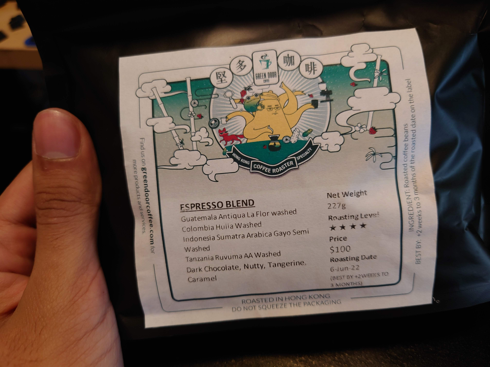
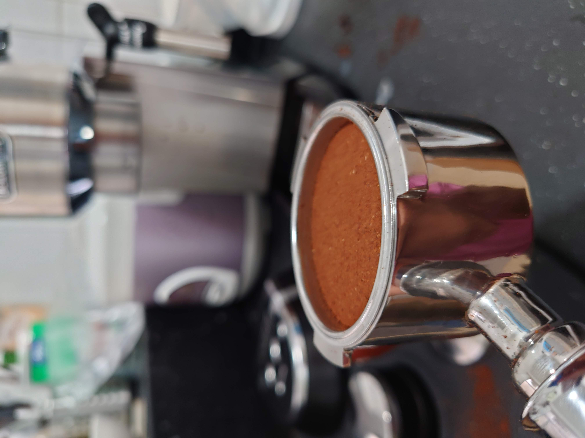
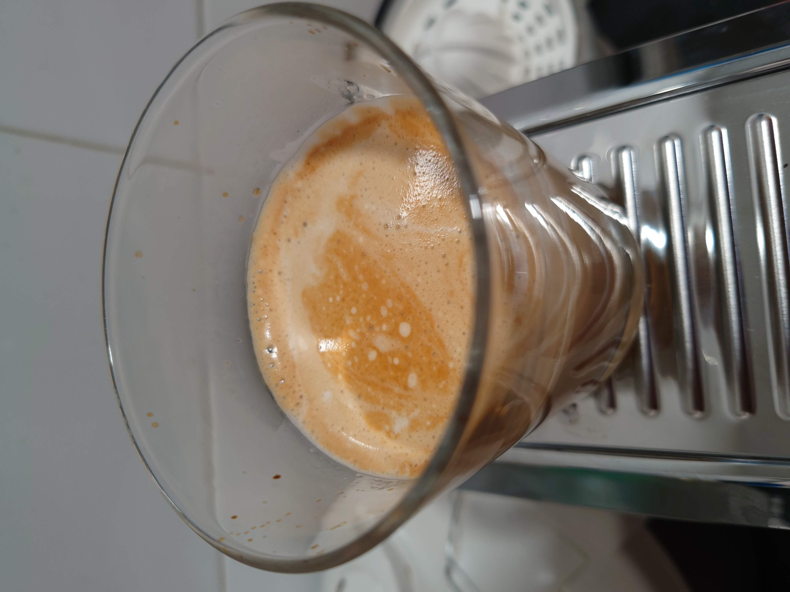

## Beans Update

Purchased an Espresso Blend from a local Coffee Shop in Shueng Wan. The roasting datde is 6th June, which means I should probably
wait  till at least the 20th to use them, but I was not patient enough.

## Recipe

I measured 14g of coffee, then hand-ground

For the actual shot, I kept the button pressed to dial in the "ideal time" for the machine to remember. I didnt measure exactly,
but I think it was ~32 seconds of extraction.

I got out 32g of espresso. I followed it up by steaming milk and making a latte, quite delicious. In fact I think I might make another one, though grinding is a pain...

